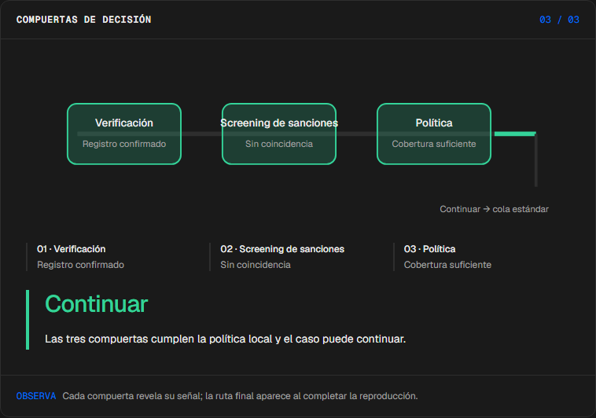
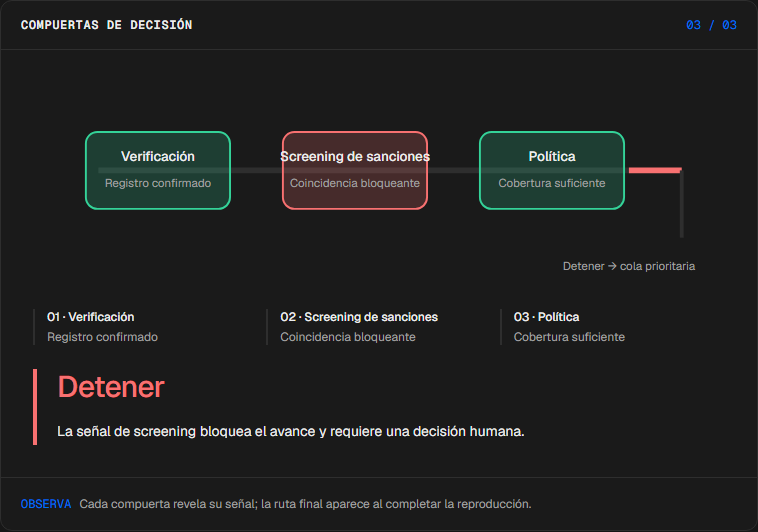
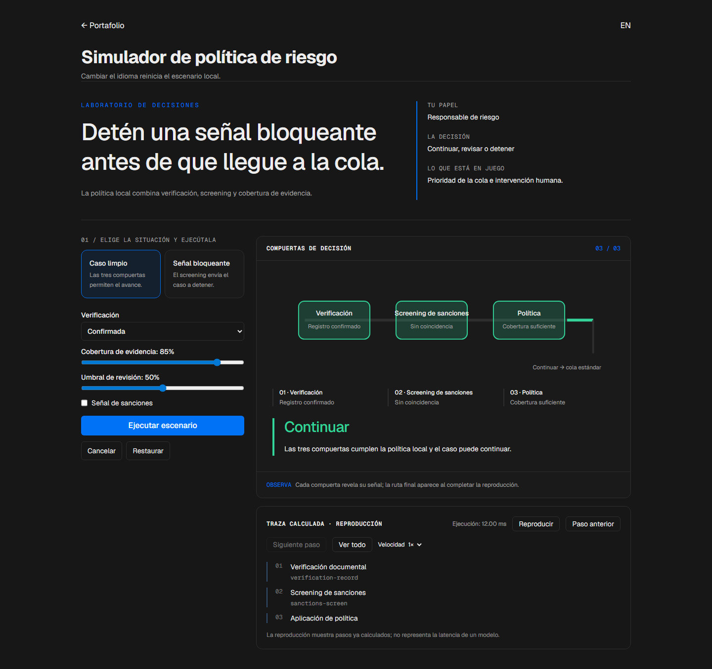

# Agente de Riesgo

<!-- community-badges -->
[](https://github.com/mdeasis27/agente-riesgo/actions/workflows/ci.yml) [](LICENSE)
<!-- /community-badges -->

[English](README.md) · [Probar demo](https://agente-riesgo-manueldeasis27-2515s-projects.vercel.app/es/app) · [Caso de estudio](https://manueldeasis.com/es/projects/agente-riesgo) · [Código](https://github.com/mdeasis27/agente-riesgo)


Cambia señales de verificación, cobertura de evidencia y umbral de revisión para inspeccionar una decisión de política.

## Dos situaciones para comparar

**Caso limpio:** verificación confirmada, sin sanciones, cobertura 85 La política permite continuar.



**Señal bloqueante:** verificación confirmada, sanciones activadas, cobertura 85 La política detiene y prioriza el caso.



## Caso de uso de negocio

Una señal bloqueante puede entrar a una cola operativa.

**Quién lo usa:** Responsable de riesgo.

**La decisión:** Continuar, revisar o detener.

Verificar, revisar screening y aplicar política.

### Prueba la decisión

**Caso limpio:** verificación confirmada, sin sanciones, cobertura 85 La política permite continuar.

**Señal bloqueante:** verificación confirmada, sanciones activadas, cobertura 85 La política detiene y prioriza el caso.

Elige un escenario, modifica sus controles y ejecuta el cálculo local. Avanza por la visualización paso a paso o revela todo. Reinicia antes de comparar el segundo escenario.

## Cómo probarlo

Abre `/en/app` (inglés, por defecto) o `/es/app` (español). Cambia los datos del escenario y ejecuta el cálculo. Inspecciona la decisión, evidencia y traza calculada. La reproducción revela pasos locales ya completados; no mide un modelo en vivo. Reiniciar empieza un escenario local nuevo. Cambiar de idioma reinicia el escenario.

La demo principal no requiere cuenta, clave de API ni base de datos. Los enlaces públicos apuntan al despliegue existente; el rediseño local está pendiente de publicación.

<!-- recruiter-mission:start -->
### Tu misión interactiva

Carga evidencia parcial, inspecciona las señales, predice opcionalmente continuar/revisar/detener y ejecuta para revelar la comparación final.

Compara umbrales de revisión 20 y 50 con la misma verificación, screening y cobertura. Puntaje = 55 si falta verificación + (100 − cobertura) / 2. Con verificación confirmada y 40% de cobertura, el puntaje 30 implica revisar con 20 y continuar con 50. Una señal de sanciones detiene ambas políticas.

**Por qué este enfoque:** Separar evidencia y política permite inspeccionar la decisión de ruta. Esta simulación determinista no predice solvencia ni identifica un umbral de revisión óptimo.

**Antes de producción:** Validar casos etiquetados, falsos positivos/negativos, equidad, privacidad, revisión humana y reglas aplicables con especialistas.

Editar datos, elegir un escenario o reiniciar borra la predicción y los resultados anteriores. La comparación aparece al completar la reproducción; las demos principales no requieren cuenta ni llave.

El piloto de misiones actualiza esta implementación. Las capturas e informes de navegador existentes documentan la etapa anterior; las comprobaciones de interacción y capturas nuevas están pendientes por bloqueos del entorno actual.
<!-- recruiter-mission:end -->

## Instalación y verificación local

Requiere Node.js 22 y pnpm 10.

```sh
pnpm install --frozen-lockfile
pnpm dev
pnpm test
node node_modules/typescript/bin/tsc --noEmit --incremental false
pnpm lint
pnpm build
```

Abre `http://localhost:3000/en/app`. La validación registrada cubre pruebas, lint, TypeScript y builds de producción. Consulta los [resultados de comandos](docs/quality/decision-lab-verification.json) y las [comprobaciones de componentes en navegador](docs/quality/decision-lab-browser.json). Estas pruebas usan componentes React y CSS de producción con navegación de idioma controlada; no certifican rutas de Next ni el despliegue público.

## Arquitectura

- `app/[lang]/`: experiencia web por idioma.
- `lib/experience/`: adaptador local tipado, validación y trazas.
- `design-system/`: tokens visuales, controles de idioma y presentación de ejecución y reproducción.
- `app/api/`: integraciones opcionales de servidor; la demo principal no las requiere.

Tecnología: Next.js 16, TypeScript, AI SDK, REST APIs, LLM API, Tailwind CSS v4.

## Evidencia y límites

Tres compuertas revelan la ruta calculada.

Carriles de evidencia y una rama de revisión; simulación de política, no predicción crediticia.

Hace inspeccionable la ruta de la política.

**Límites:** Simulación local; no realiza screening externo. Estos prototipos de portafolio no afirman impacto medido en producción.

Los datos son ejemplos ficticios o anónimos. Las integraciones opcionales requieren sus propias credenciales y configuración. Los secretos pertenecen al gestor configurado, nunca a archivos locales de secretos ni Git. Usa el flujo existente `infisical run -- <command>` si necesitas integraciones en vivo. La demo local no publica ni despliega automáticamente.



<!-- community-section -->
## Licencia y contribución

Publicado bajo la [licencia MIT](LICENSE). Se aceptan issues y pull requests: lee antes [CONTRIBUTING.md](CONTRIBUTING.md) y el [Código de Conducta](CODE_OF_CONDUCT.md). Para reportar una vulnerabilidad, consulta [SECURITY.md](SECURITY.md).
<!-- /community-section -->
