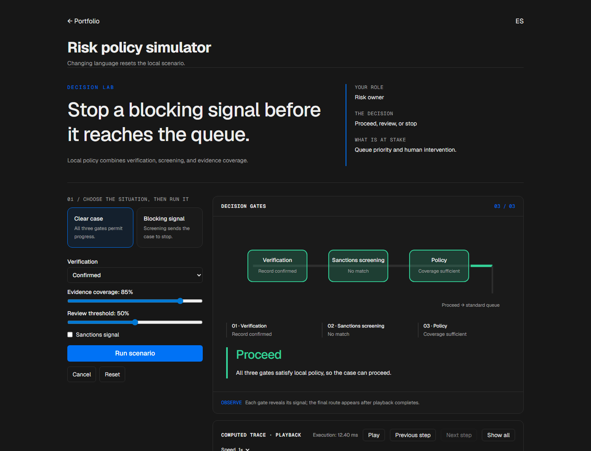
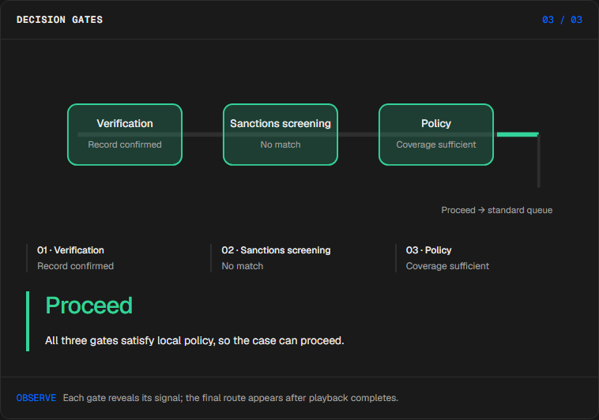
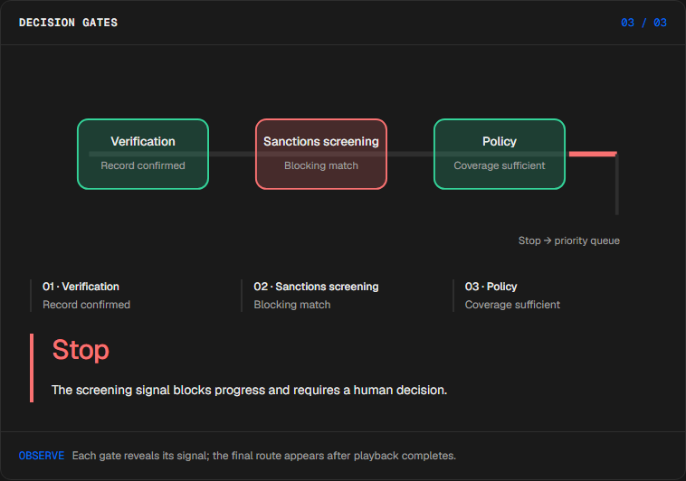
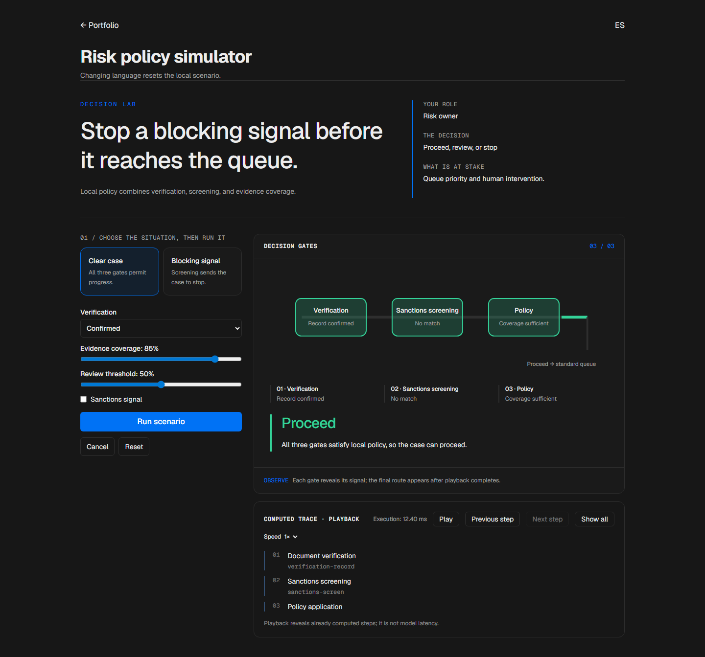

# Risk triage

<!-- community-badges -->
[](https://github.com/mdeasis27/agente-riesgo/actions/workflows/ci.yml) [](LICENSE)
<!-- /community-badges -->

[Español](README.es.md) · [Try the demo](https://agente-riesgo-manueldeasis27-2515s-projects.vercel.app/en/app) · [Case study](https://portafolio-mdea.vercel.app/en/projects/agente-riesgo) · [Source](https://github.com/mdeasis27/agente-riesgo)



Change verification flags, evidence coverage, and the review threshold to inspect a policy decision.

## Two situations to compare

**Clear case:** confirmed verification, no sanctions, 85 coverage The policy proceeds.



**Blocking signal:** confirmed verification, sanctions enabled, 85 coverage The policy stops and prioritizes the case.



## Business use case

A blocking signal can enter an operational queue.

**Who uses it:** Risk owner.

**The decision:** Proceed, review, or stop.

Verify, screen, then apply policy.

### Try the decision

**Clear case:** confirmed verification, no sanctions, 85 coverage The policy proceeds.

**Blocking signal:** confirmed verification, sanctions enabled, 85 coverage The policy stops and prioritizes the case.

Choose a scenario, edit its controls and run the local computation. Step through the visual process or reveal all steps. Reset before comparing the second scenario.

## How to try it

Open `/en/app` (English, default) or `/es/app` (Spanish). Change the scenario inputs and run the computation. Inspect the resulting decision, evidence and computed trace. Playback reveals completed local steps; it does not measure a live model. Reset starts a new local scenario. Changing language resets the scenario.

The primary demo needs no account, API key or database. Public links refer to the existing deployment; local redesign changes are pending publication.

<!-- recruiter-mission:start -->
### Your interactive mission

Load partial evidence, inspect the signals, optionally predict proceed/review/stop, then execute and reveal the terminal comparison.

Compare review thresholds 20 and 50 with identical verification, screening and coverage. Score = 55 for missing verification + (100 − coverage) / 2. With confirmed verification and 40% coverage, score 30 means review at 20 and proceed at 50. A sanctions signal stops both policies.

**Why this approach:** Keeping evidence separate from policy makes the routing decision inspectable. This deterministic simulation does not predict creditworthiness or identify an optimal review threshold.

**Before production:** Validate labeled cases, false positives/negatives, fairness, privacy, human review and applicable rules with specialists.

Editing inputs, choosing a preset or resetting clears the prediction and obsolete results. Comparisons appear only at completed playback; the primary demos need no account or key.

The mission pilot updates this implementation. Existing screenshots and browser reports document the previous stage; fresh browser interaction checks and captures are pending because the current environment blocked them.
<!-- recruiter-mission:end -->

## Local setup and verification

Requires Node.js 22 and pnpm 10.

```sh
pnpm install --frozen-lockfile
pnpm dev
pnpm test
node node_modules/typescript/bin/tsc --noEmit --incremental false
pnpm lint
pnpm build
```

Open `http://localhost:3000/en/app`. Recorded validation covers tests, lint, TypeScript and production builds. See [command results](docs/quality/decision-lab-verification.json) and [browser component checks](docs/quality/decision-lab-browser.json). The new browser checks exercise real React components and production CSS with controlled locale navigation; they do not certify Next routes or public deployment.

## Architecture

- `app/[lang]/`: localized browser experience.
- `lib/experience/`: typed local adapter, validation and run traces.
- `design-system/`: shared visual tokens, locale controls and execution/replay presentation.
- `app/api/`: optional server integrations; the primary demo does not require them.

Technology: Next.js 16, TypeScript, AI SDK, REST APIs, LLM API, Tailwind CSS v4.

## Evidence and limitations

Three evidence gates reveal the computed route.

Evidence lanes and a review branch; a policy simulation, not a credit prediction.

Makes the policy route inspectable.

**Limits:** Local simulation; no external screening is performed. These portfolio prototypes do not claim measured production impact.

Inputs use fictional or anonymized examples. Optional live integrations require their own credentials and operational setup. Secrets belong in the configured secret manager, never in local secret files or Git. Use the existing `infisical run -- <command>` workflow when live integration is needed. This repository does not publish or deploy automatically as part of the local demo.



<!-- community-section -->
## License and contributing

Released under the [MIT License](LICENSE). Issues and pull requests are welcome: read [CONTRIBUTING.md](CONTRIBUTING.md) and the [Code of Conduct](CODE_OF_CONDUCT.md) first. To report a vulnerability, see [SECURITY.md](SECURITY.md).
<!-- /community-section -->
